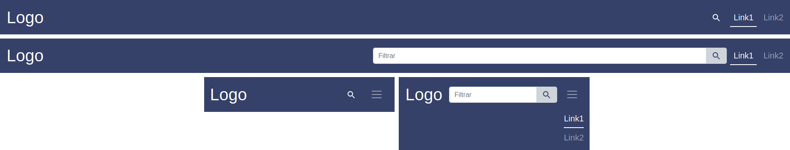

# iron-pages-navbar

A Polymer element of a completely responsive navbar for your [`<iron-pages>`](https://www.webcomponents.org/element/@polymer/iron-pages) navigation. [](https://travis-ci.org/joemccann/dillinger)

## About



`<iron-pages-navbar>` is a completely responsive Bootstrap-based navigation bar which allows the user to cycle through the children of your [`<iron-pages>`](https://www.webcomponents.org/element/@polymer/iron-pages) element. It also includes a switchable input element to perform term searches. These terms are passed to the element's `query` property, which can be used to handle the search action according to your needs.

## Authors

1. Luis Cristóbal López García

## Usage

### Installation

```bash
$ npm install --save iron-pages-navbar
```

### In an HTML file

```
<iron-pages-navbar
    selected="{{selected}}"
    links='[
        {
            "title": "Link1",
            "id": "myid",
            "class": "class1 class2"
        },
        {
            "title": "Link2",
            "href": "https://www.otherpage.com",
            "target": "_blank"
        }
    ]'
    maincolor="#354169"
    query="{{query}}">
</iron-pages-navbar>
```

### Properties

There are a few properties you can define in order to customize the element:

* **selected:** indicates the currently displayed page of the `<iron-pages>` element.
* **links:** array of dictionaries containing each link information. Links must at least have a `title` key containing the text you want to show on the navbar. Besides, there are also some optional keys you can include according to your needs, as `id`, `class`, `href` and `target`.
* **maincolor:** bar background color. You can use any value admitted by the CSS property.
* **query:** property where the user introduced term is stored. You can handle the search by binding it to a listener or any other desired property in your main app, and perform the logic there.


## License

Copyright © 2020 Grupo de Sistemas Inteligentes.

Licensed under the Apache License, Version 2.0 (the "License"); you may not use this file except in compliance with the License. You may obtain a copy of the License at:

```
http://www.apache.org/licenses/LICENSE-2.0
```

Unless required by applicable law or agreed to in writing, software distributed under the License is distributed on an "AS IS" BASIS, WITHOUT WARRANTIES OR CONDITIONS OF ANY KIND, either express or implied. See the License for the specific language governing permissions and limitations under the License.
